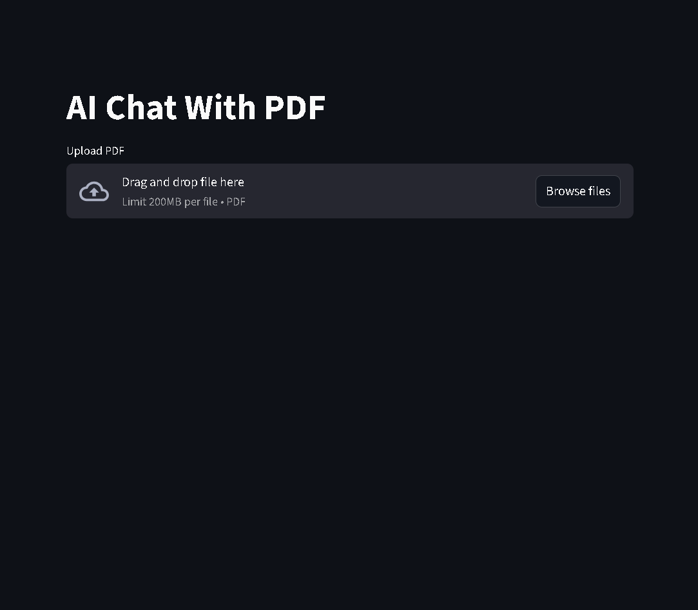
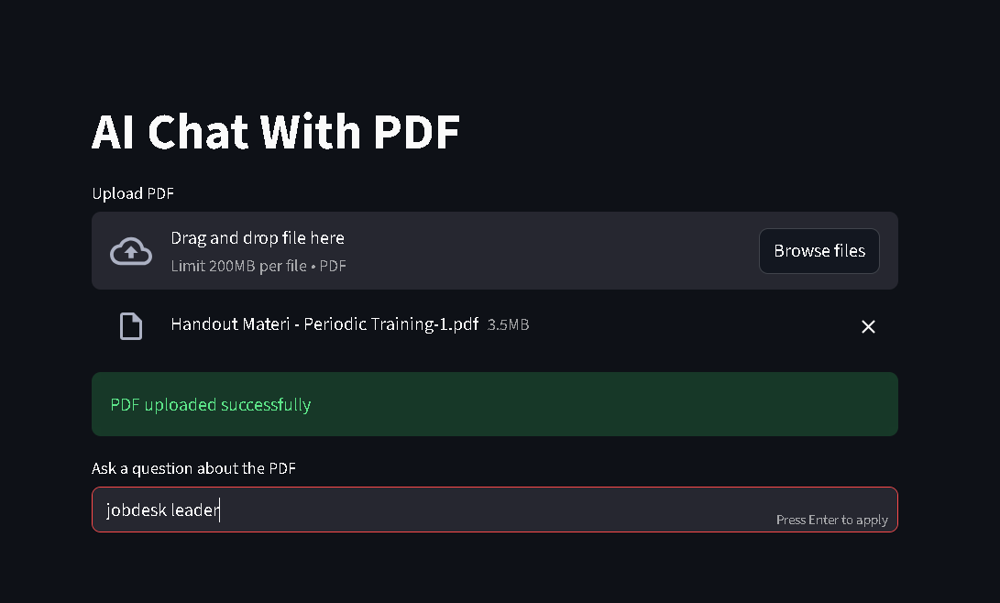
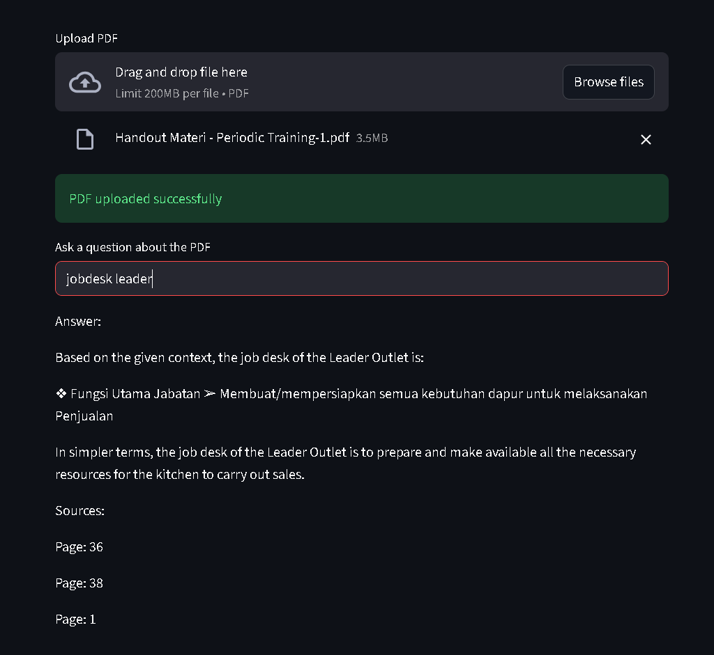

# AI PDF Chat

AI PDF Chat is a simple application that allows users to ask questions about a PDF document using a local LLM.
The system converts the content of the PDF into vector embeddings and retrieves the most relevant context when answering a question.

## Features
* Upload a PDF file
* Convert PDF content into vector embeddings
* Retrieve relevant document context
* Answer questions using a local LLM

## Tech Stack
* Python
* Streamlit — web interface for the application
* LangChain — framework for building the RAG pipeline
* Ollama — runs the LLM locally without requiring an API key
* Llama3 — the local language model used for answering questions
* Sentence Transformers — converts text into vector embeddings
* Chroma — lightweight vector database for storing and retrieving embeddings

## Prerequisites
* Python 3.9+
* [Ollama](https://ollama.com/download) installed on your machine

## Installation
Clone the repository:
```
git clone https://github.com/einzeinn/ai-pdf-chat.git
cd ai-pdf-chat
```

Create a virtual environment:
```
python -m venv venv
```

Activate the virtual environment.

Windows:
```
venv\Scripts\activate
```

Mac/Linux:
```
source venv/bin/activate
```

Install dependencies:
```
pip install -r requirements.txt
```

Pull the required model:
```
ollama pull llama3
```

## Running the Application
Start the Ollama server:
```
ollama serve
```

Start the application:
```
streamlit run app.py
```

## How It Works
1. The user uploads a PDF file
2. The system reads and splits the PDF content into chunks
3. Each chunk is converted into vector embeddings using Sentence Transformers
4. The embeddings are stored in a Chroma vector database
5. When the user asks a question, the system retrieves the most relevant chunks
6. The retrieved context is passed to Llama3 via Ollama to generate an answer

## Future Improvements
* Support multiple PDFs
* Add chat history
* Improve the UI
* Support more LLM models

## Demo

*Step 1: Initial application view*


*Step 2: Upload a PDF file*


*Step 3: The model answers a question based on the PDF*
